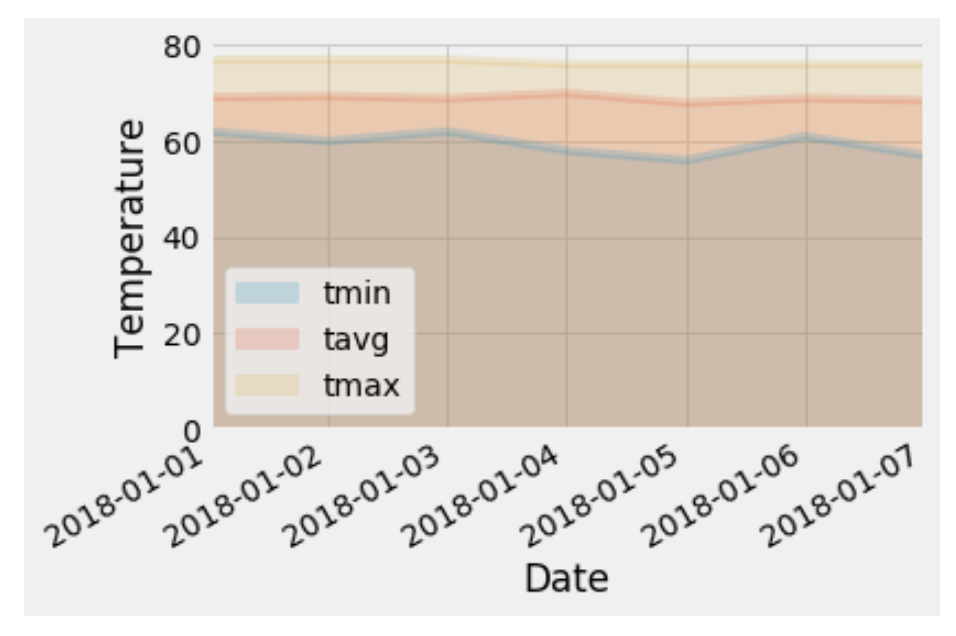

Surf’s Up

## Instructions

### Part 1: Climate Analysis and Exploration

In this section, we’ll use Python and SQLAlchemy to perform basic climate analysis and data exploration of climate database. 

#### Precipitation Analysis

To perform an analysis of precipitation in the area, do the following:

* Find the most recent date in the dataset.

* Using this date, retrieve the previous 12 months of precipitation data by querying the 12 previous months of data. **Note:** Do not pass in the date as a variable to your query.

* Select only the `date` and `prcp` values.

* Load the query results into a Pandas DataFrame, and set the index to the date column.

* Sort the DataFrame values by `date`.

* Plot the results by using the DataFrame `plot` method, as shown in the following image:

  

* Use Pandas to print the summary statistics for the precipitation data.

#### Station Analysis

To perform an analysis of stations in the area, do the following:

* Design a query to calculate the total number of stations in the dataset.

* Design a query to find the most active stations (the stations with the most rows).

   
* Design a query to retrieve the previous 12 months of temperature observation data (TOBS).

  
    

### Part 2: Design Your Climate App

Design a Flask API based on the queries that have just developed.

### Bonus:

* Use the provided [temp_analysis_bonus_1_starter.ipynb](temp_analysis_bonus_1_starter.ipynb) and [temp_analysis_bonus_2_starter.ipynb](temp_analysis_bonus_2_starter.ipynb) starter notebooks for their respective bonus challenge.

#### Temperature Analysis 1

Conduct an analysis to answer the following question: Hawaii is reputed to enjoy mild weather all year round. Is there a meaningful difference between the temperatures in, for example, June and December?

* Use Pandas to perform the following steps:

    * Convert the date column format from `string` to `datetime`.

    * Set the date column as the DataFrame index.

    * Drop the date column.

* Identify the average temperature in June at all stations across all available years in the dataset. Do the same for the temperature in December.

* Use the t-test to determine whether the difference in means, if any, is statistically significant. Will you use a paired t-test or an unpaired t-test? Why?

#### Temperature Analysis 2

we want to take a trip from August 1 to August 7 of this year, but you are worried that the weather will be less than ideal. Using historical data in the dataset, find out what the temperature has previously been for this timeframe.

**Note:** The starter notebook contains a function called `calc_temps` that will accept a start date and end date in the format `%Y-%m-%d`. The function will return the minimum, average, and maximum temperatures for that range of dates.

Complete the following steps:

* Use the `calc_temps` function to calculate the minimum, average, and maximum temperatures for your trip using the matching dates from a previous year (for example, use "2017-08-01").

* Plot the minimum, average, and maximum temperature from your previous query as a bar chart, as captured in the following steps and image:

    * Use "Trip Avg Temp" as the title.

    * Use the average temperature as the bar height (_y_ value).

    * Use the peak-to-peak (TMAX-TMIN) value as the _y_ error bar (YERR).

    

#### Daily Rainfall Average

Now that we have an idea of the temperature, let’s find out what the rainfall has been. You don't want to visit if it rains the whole time! Complete the following steps:

* Calculate the rainfall per weather station using the previous year's matching dates.

    * Sort this in descending order by precipitation amount, and list the station, name, latitude, longitude, and elevation.

### Daily Temperature Normals

* Plot an area plot (`stacked=False`) for the daily normals

  

